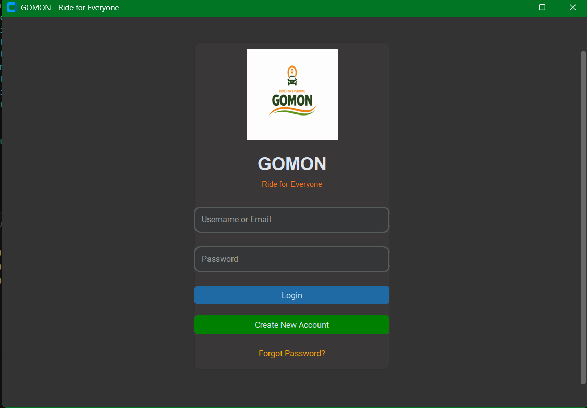
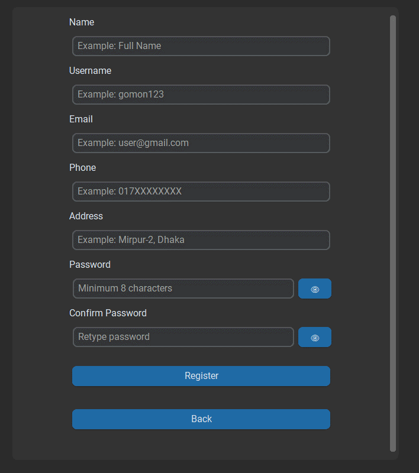
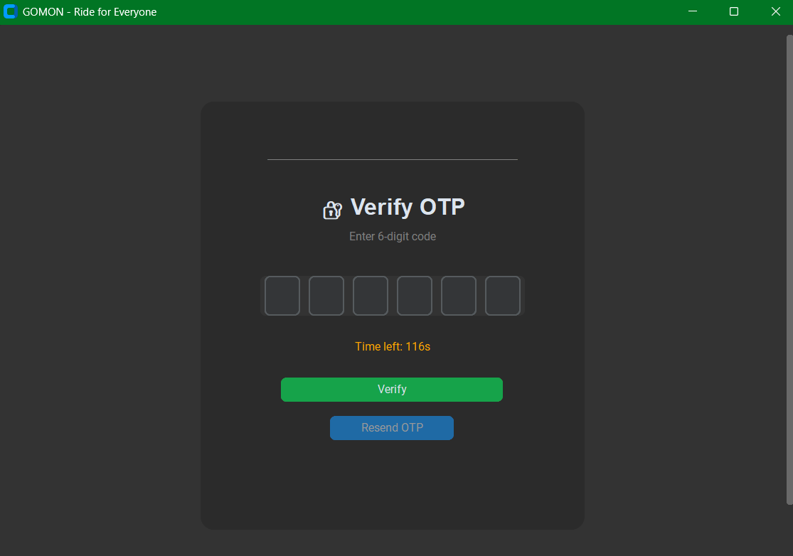
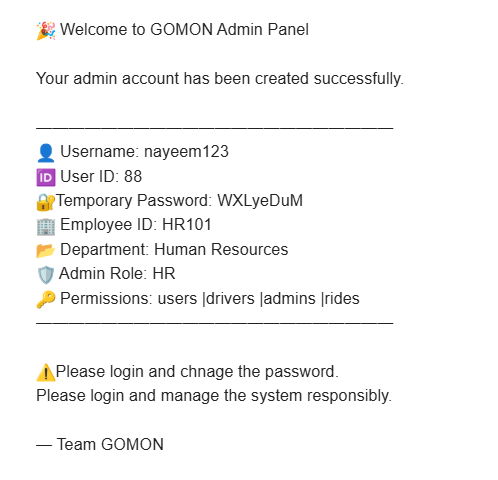
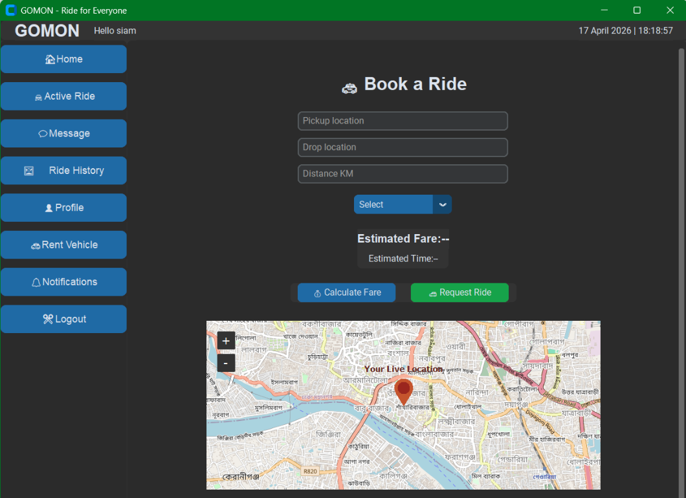
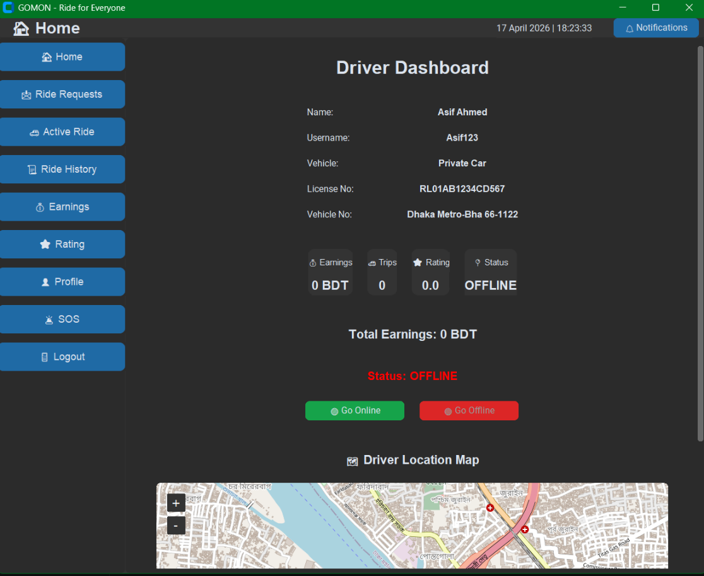
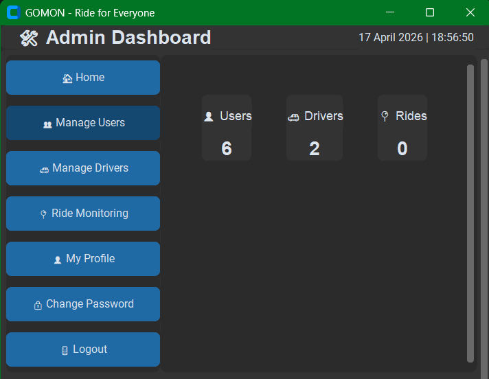
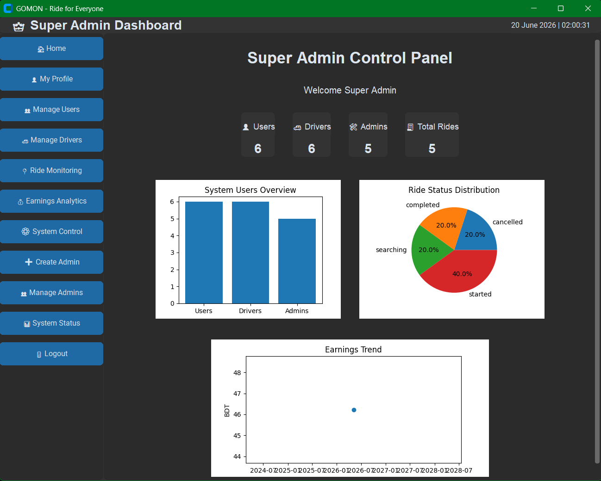
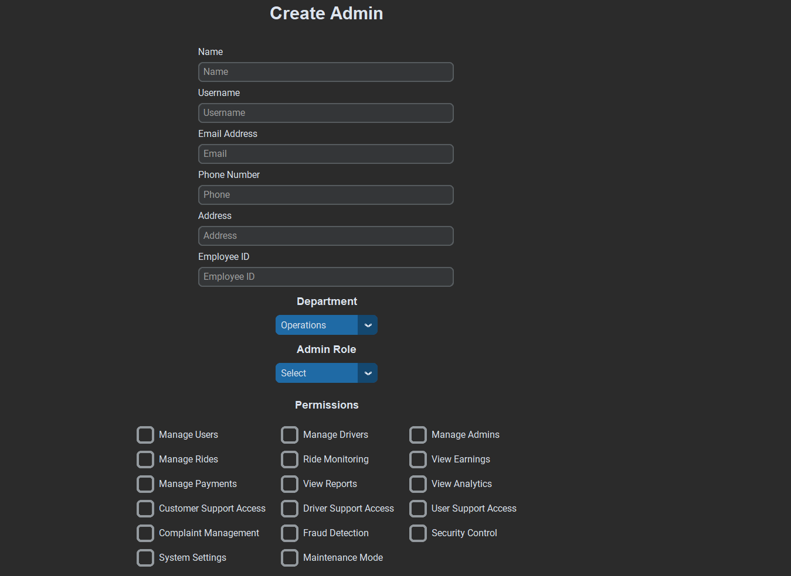

# GOMON (Ride for everyone)

Ride Sharing and Transportation Management System

## Overview
GOMON is a Ride Sharing and Transportation Management System developed using Python.

## Features
- User Registration & Login
- Driver Management
- Ride Booking
- OTP Verification
- Permission Based Admin Dashboard
- Super Admin Dashboard

## Technologies
- Python
- CustomTkinter
- Database
- mySQL
- GitHub

## Future Features
- Live Tracking
- Digital Payment
- Emergency SOS
- AI Integration 
## 📸 Screenshots

### Login Page

### Registration Page

### OTP Verification

### Email OTP Sending

### User Dashboard

### Driver Dashboard

### Admin Dashboard

### Super Admin Dashboard

### Create Admin by Super Admin

